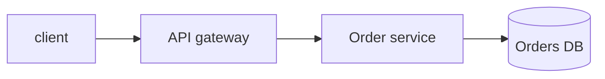

# Documentation Standards

How docs get written, reviewed, and kept honest. This is the deep "how to do docs well" home;
the high-level *policy* (what's worth documenting, what stays out of git) lives in
[collaboration.md](collaboration.md) §7 and the **ADR process** in its §6. *When* a decision
warrants an ADR is set by [architecture.md](../design/architecture.md) §4. This doc expands and
defers — it doesn't restate those.

> **One law:** a doc that contradicts the code is a bug — fix it in the same PR as the code.

---

## 1. Docs as code

Documentation is source. It lives **in the repo**, ships in the same PR as the change it
describes, and is reviewed with the same rigour as code.

- **In-repo, not in a wiki.** Long-form docs live under `docs/`; the entry point is `README.md`.
  A wiki/Notion drifts the moment code moves — version docs with the code so a checkout is the
  truth. _(Escape hatch: a published doc site is fine **if** it's generated from `docs/` in CI,
  not hand-edited out of band.)_
- **Reviewed like code.** Docs go through PR review, CI lint, and CODEOWNERS — not a side channel.
- **Verified against the codebase.** A claim about behaviour, a flag, a path, or an interface
  must match reality. Where practical, make examples **executable** so CI catches drift (§2).
- **Distil, don't dump.** Throwaway AI/agent planning and spec scratch never get committed
  ([collaboration.md](collaboration.md) §4); promote anything durable into a real doc instead.

## 2. The README is a contract

The README is the first thing a human or agent reads; treat its promises as testable.

- **Lead with a quickstart** that takes a clean checkout to a running thing. Keep it to the
  canonical task-runner targets — `just setup`, `just test`, `just run` ([collaboration.md](collaboration.md) §5).
- **CI-execute the quickstart where practical.** A README that lies is worse than none. Run the
  documented commands in a job (or extract fenced blocks and exec them) so stale steps fail the build.

```bash
# CI smoke: the README quickstart must actually work on a clean checkout
just setup && just test
```

- **Cover the contract, not the codebase:** what it does, how to run it, how to configure it
  (env vars), and where to go next. Architecture and rationale belong in `docs/`, not the README.

## 3. Shape: Diátaxis

Sort docs by the reader's job, not by feature. The four modes keep reference separate from
teaching so neither rots the other.

| Mode | Reader wants | Example |
|---|---|---|
| **Tutorial** | to learn by doing | "Build your first widget" |
| **How-to** | to accomplish a task | "Rotate the signing key" |
| **Reference** | to look up facts | API spec, config table, CLI flags |
| **Explanation** | to understand *why* | "Why we chose eventual consistency" |

Keep **reference generated** (§4) and **explanation hand-written**; don't blend a tutorial into an
API reference. Most repos need a strong README, a `docs/how-to/`, and generated reference — the
other modes grow only when readers ask.

## 4. Reference docs are generated, never hand-typed

Hand-maintained API reference drifts the instant the code changes. Generate it from the source of
truth and publish in CI.

| Stack | Generator | Source of truth |
|---|---|---|
| REST | **Redocly** (or Swagger UI) | `openapi.yaml` — the committed contract ([api-design.md](../design/api-design.md) §7) |
| gRPC | **protoc-gen-doc** | `.proto` files |
| TypeScript | **TypeDoc** | TSDoc comments |
| Python | **Sphinx** + autodoc/MyST _(escape hatch: mkdocstrings + MkDocs)_ | docstrings |
| Go | **`go doc`** / pkg.go.dev | doc comments |
| Rust | **rustdoc** (`cargo doc`) | `///` comments |

- **API reference derives from the API contract**, not from a parallel hand-written page — link
  [api-design.md](../design/api-design.md), which owns OpenAPI/proto/SDL as the source of truth.
- Build the docs in CI (`cargo doc`, `typedoc`, `sphinx-build -W`) with **warnings as errors** so
  a broken reference (missing symbol, dead xref) fails the PR.

## 5. Docstrings & comments: why, not what

Comments explain intent the code can't; they are not a transcript of the code.

- **Comment the *why*** — the constraint, the trade-off, the non-obvious reason — never restate
  *what* the next line plainly does. Self-explanatory code needs no comment; tricky code needs the
  reason it's tricky.
- **Public API carries a docstring**; internal helpers earn one only when intent isn't obvious.
- **Enforce style with the stack's linter**, not review nags:

| Stack | Convention | Enforced by |
|---|---|---|
| Python | Google or NumPy docstrings | **Ruff** `D` (pydocstyle) rules |
| TypeScript | **TSDoc** | `eslint-plugin-tsdoc` |
| Go | full-sentence doc comments | `go vet` / `revive` |
| Rust | `///` doc comments | `cargo clippy` `missing_docs` |

- **No commented-out code** — git is the history ([collaboration.md](collaboration.md) §1). Never
  commit `TODO`/`FIXME` without a tracked issue link.

## 6. Diagrams as code

A picture in a binary `.png` rots silently. Author diagrams as text so they diff, review, and
render in-repo.

- **Mermaid by default** — it renders natively on GitHub and lives in fenced blocks inside Markdown,
  so the diagram travels with the prose.



- _Escape hatch:_ **D2** or **PlantUML** for large/complex diagrams Mermaid renders poorly; **C4**
  (Context/Container) as diagram-as-code per [architecture.md](../design/architecture.md) §4.
- **No binary diagram blobs** as the source — commit the text; render to an image in CI if a site
  needs one.

## 7. Operational docs & runbooks

Every page-able alert links a runbook; the runbook is owned by the operational standard, not here.

- **Runbooks, SLOs, and the on-call/observability surface** live with the system they operate and
  are defined by [devops.md](../platform/devops.md) §7–8 — link there, don't duplicate.
- A runbook is a **how-to** (§3): symptom → diagnosis → remediation → escalation, written so a
  half-asleep on-call can follow it. Keep it next to the service and verified against the alert.

## 8. Changelog: generated from commits

The changelog is for **consumers** deciding whether to upgrade — keep it human-readable and
machine-generated.

- **Keep a Changelog** format, generated from **Conventional Commits** by release automation
  (release-please/changesets) — don't hand-maintain it. Owned by [ci-cd.md](../platform/ci-cd.md)
  §11 and [collaboration.md](collaboration.md) §7; this doc just sets the *format* expectation.
- Group by `Added` / `Changed` / `Fixed` / `Removed` / `Security`; an **`[Unreleased]`** section
  accrues per PR. Reversed or removed behaviour carries a one-line migration note.

## 9. Doc linting & link-checking

Docs get the same automated gates as code so quality isn't a review judgement call.

| Concern | Tool | Where |
|---|---|---|
| Markdown style | **markdownlint-cli2** | pre-commit + CI |
| Dead links | **lychee** (fast, offline-friendly) | CI |
| Prose style _(optional)_ | **Vale** with a shared style | CI, non-blocking first |

- Wire markdownlint and link-checking into **pre-commit** so they run locally and in CI from one
  config and never drift ([collaboration.md](collaboration.md) §5).
- Generated-reference builds run with `-W` / warnings-as-errors (§4); treat a doc-build warning as
  a failed gate.

## 10. Keep docs current: the same-PR rule

- **Docs change in the PR that changes the behaviour.** A behaviour or interface change with stale
  docs is an incomplete PR — CODEOWNERS on `docs/` and the README backs this.
- **Delete docs for deleted features** in the same change; a doc for code that no longer exists is
  as wrong as a doc that contradicts code.
- Date or version anything time-sensitive (deprecation windows, runbooks) so staleness is visible.

## Definition of done

- [ ] Long-form docs live in `docs/`; README is the entry point — no canonical doc lives only in a wiki
- [ ] README quickstart uses the task-runner targets and is CI-executed where practical
- [ ] Docs sorted by Diátaxis mode; reference is generated, explanation is hand-written
- [ ] API/reference docs are generated from source (contract/docstrings) and built in CI with warnings-as-errors
- [ ] Docstring style enforced by the stack linter (Ruff `D` / tsdoc / `go vet` / clippy); comments explain *why*
- [ ] Diagrams are diagram-as-code (Mermaid default); no binary blob is the source of truth
- [ ] Runbooks link an alert and follow [devops.md](../platform/devops.md); ADRs follow [collaboration.md](collaboration.md) §6
- [ ] `CHANGELOG.md` is Keep-a-Changelog, generated from Conventional Commits ([ci-cd.md](../platform/ci-cd.md) §11)
- [ ] markdownlint + link-check run in pre-commit and CI and are green
- [ ] Docs updated (or deleted) in the same PR as the behaviour they describe

**Sources:** [Diátaxis](https://diataxis.fr) · [Keep a Changelog](https://keepachangelog.com) · [Docs as Code (Write the Docs)](https://www.writethedocs.org/guide/docs-as-code/)
